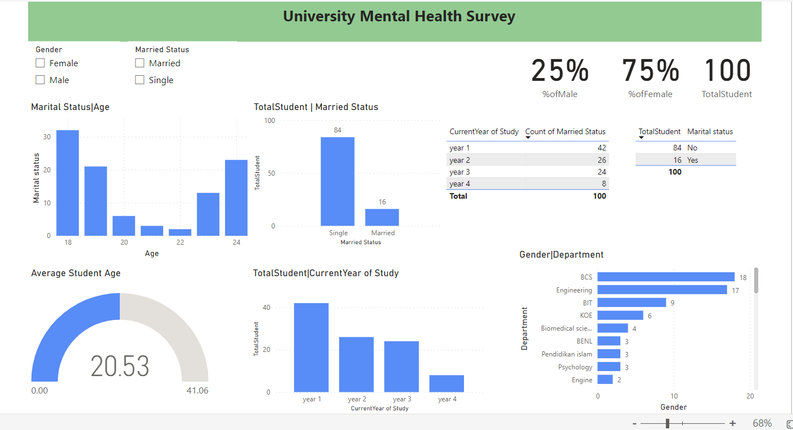
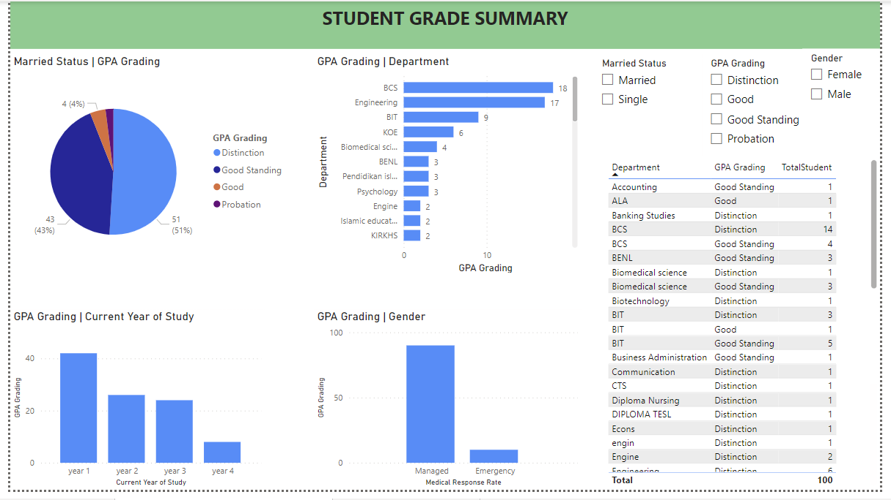
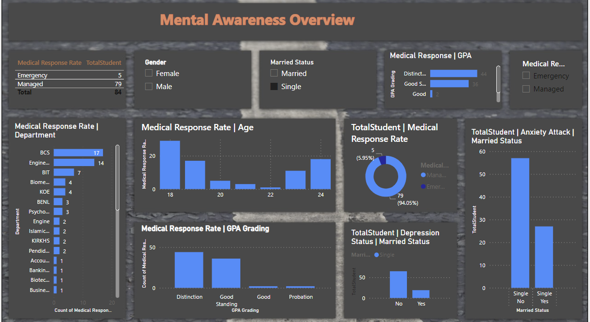

# Hamfield College Student Mental Health Analysis

--

## Introduction
This analysis is a Power BI Project to analyse Hamfield College student mental health. The project is to analyze and derive insights to answer crucial questions addressing student productivity decline and also help the school make data driven decision. 

**_Disclaimer**: _All datasets and reports do not represent any company, institution or country, but just a dummy dataset to demonstrate capabilities of Power BI._ 

## Problem Statement
1. What Category of student are dealing with mental health issues like depression, Anxiety and Panic Attack
2. What is the Average student facing all 3 Mental health issues. 
3. What is the average Age of student dealing with Mental health. 
4. What department has the highest rate of student dealing with mental health. 
5. How quickly should the school respond to the issue using the data provided. 
6. What are the possible recommendation to address the issue. 

## Skills/Concept Demonstrated

The following PowerBI function were incorporated:

- Quick Measures,
- Filters,
- Page Navigation,
- DAX,

##  Modelling:
The data only has a single table hence no modelling was required. 

## Visualisation:

The report comprises 3 pages:
1.  Student Demographic
2.  Student Grade Overview
3.  Mental Health Overview

you can interact with the report [here](https://app.powerbi.com/links/GP8o0vjA-u?ctid=99f37d21-0b5c-43ea-9103-e16f02f5aecf&pbi_source=linkShare&bookmarkGuid=118c3ec3-acaa-4cf4-b900-e142f3c0a2ff)

Features:
- All filter bottons are used to select information such as gender, marital status and other student demographic information. 

## Visual Interpretation:

###  Student Demographic:
- 100 Students participated in the survey, 25% of the student identify as Male while 75% Identify as female. 
- The average age of the participant is 21 years of age. 
- 84 students are single and 16 are married with respect to thier marital status. 
- Most of the participant are student from the Department of (BCS) Bachelors of Computer Science and Engineering. 
- The large number of student facing mental health challenges are Year 1 students in the university. 

###  Grade Summary:

## Visual Interpretation:

BCS department has a lot of Honours student with distinctions in thier academic. However, Most of this student are currently in thier First Year and are battling with mental health issues like Depression, Panic Attack and Anxiety. The Insights also shows that the over average of the students are female and are single as well. 

### Mental Health Summary

## Visual Interpretation:

A special DAX was created called Medical Response Rate which were divided into Two: "Managed and Emergency". This was used to predict student that need immediate attention following thier mental health issue as a lot of the student were not properly addressing the situation. 

The visuals shows that
- Student in BTS (Bachelors in Computer Science) department need to be given urgent attention.
- All student with mental health issues specificaly age 19 need to be attended to with emergency.
- 75% of the student with mental health issues can be managed by putting in place measures to help them. 
- Most of the student that need medical care urgently are single and are Honours student.  

## Conclusion

- BCS has the highest Number of student with mental health issues.  Nevertheless, Student in the Department of Information Technology Urgent care as most of thier student fall within the emergency care catergory. which means they have all three mental health issue analyse in this data (Panic Attack, Depression and Anxiety). 
- Student with GPA between 3.00 - 4.00 are greatly affected. 
- Only 5% of the students need urgent care. 
- Most student are not seeking for help.

## Recommendation

- Help shy students at school by creating a special box where they can seek personal advice anonymously through written notes.
- Train teachers to pay attention and notice students who may need support.
- Encourage student participation by organizing school programs and groups.
- Appoint student ambassadors in school and classrooms to improve communication and make students feel more comfortable talking to their peers.
- Develop programs that promote student wellbeing and overall mental and emotional health.
- Regularly review and improve teaching methods and course materials, if possible.
- Conduct surveys to gather feedback from students about their wellbeing and academic progress, and use that information to track their development.

